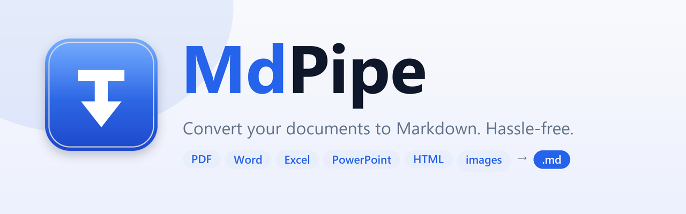
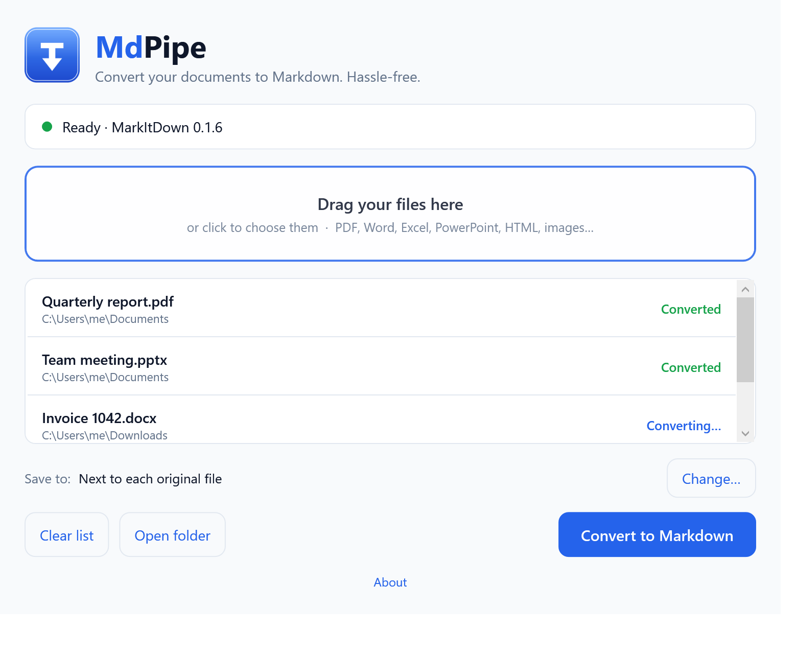

<p align="center">
  
</p>

# MdPipe

MdPipe is a small Windows app and CLI that converts PDF, Word, Excel, PowerPoint,
HTML and image files to Markdown. It uses Microsoft's
[MarkItDown](https://github.com/microsoft/markitdown) as its conversion engine and
manages the Python environment for the user.

<p align="center">
  
</p>

## Why I built it

I wanted a document converter that I could give to someone who does not use a
terminal or have Python installed. Calling MarkItDown was the easy part; the
interesting work was packaging it as a portable Windows application, keeping
its dependencies isolated and making the first-run setup understandable when a
proxy or firewall gets in the way.

## What it does

- Converts several files in one batch using drag and drop.
- Saves the Markdown beside the original or in a chosen folder.
- Runs locally and does not upload documents or collect telemetry.
- Includes a CLI for scripts and automation.
- Uses a validated MarkItDown version instead of upgrading unexpectedly.

## Download

Download [`MdPipe.exe`](https://github.com/gdols/MdPipe/releases/latest/download/MdPipe.exe)
from the [latest release](https://github.com/gdols/MdPipe/releases/latest).

It is a portable, self-contained Windows 10/11 x64 executable. The first launch
downloads a private Python environment and MarkItDown into `%APPDATA%\mdpipe`;
later conversions work offline. Because the executable is not code-signed yet,
Windows SmartScreen may ask you to confirm that you want to run it.

## CLI

Install the .NET global tool:

```bash
dotnet tool install --global MdPipe

mdpipe convert report.pdf
mdpipe convert report.pdf -o report.md
mdpipe status
```

## Technical decisions

- **One engine, two front ends.** The WPF app and CLI share `MdPipe.Core` and
  `MdPipe.Infrastructure`, so conversion and setup behave the same in both.
- **Isolated dependencies.** MdPipe creates its own environment under AppData
  and never modifies the system Python or `PATH`.
- **Controlled upgrades.** A compatibility manifest lists the MarkItDown
  versions tested with MdPipe. See [version control](docs/version-control.md).
- **Useful failure messages.** Setup reports errors from Python and pip, including
  common corporate proxy and firewall failures.

## Build and test

You need the [.NET 10 SDK](https://dotnet.microsoft.com/download):

```bash
git clone https://github.com/gdols/MdPipe.git
cd MdPipe

dotnet run --project src/MdPipe.Wpf
dotnet test
```

To build the portable executable:

```bash
dotnet publish src/MdPipe.Wpf -c Release -r win-x64 --self-contained -p:PublishSingleFile=true
```

## Current limitations

- Official releases currently target Windows x64 only.
- The first launch needs internet access to download Python and MarkItDown.
- The executable is not code-signed, so new releases can trigger SmartScreen.
- Conversion quality depends on the source format and MarkItDown.

## Contributing

Bug reports and small pull requests are welcome. See
[CONTRIBUTING.md](CONTRIBUTING.md) and [SECURITY.md](SECURITY.md).

## License

MdPipe is available under the MIT license. It is an independent project and is
not affiliated with Microsoft. MarkItDown is fetched from PyPI at runtime and
is not redistributed; see [NOTICE.md](NOTICE.md).

