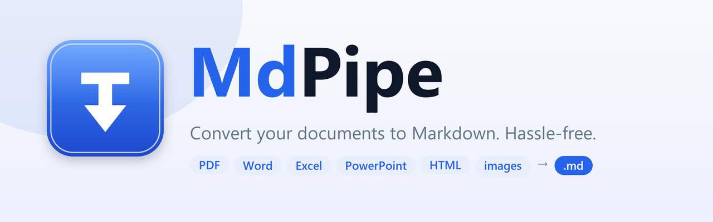
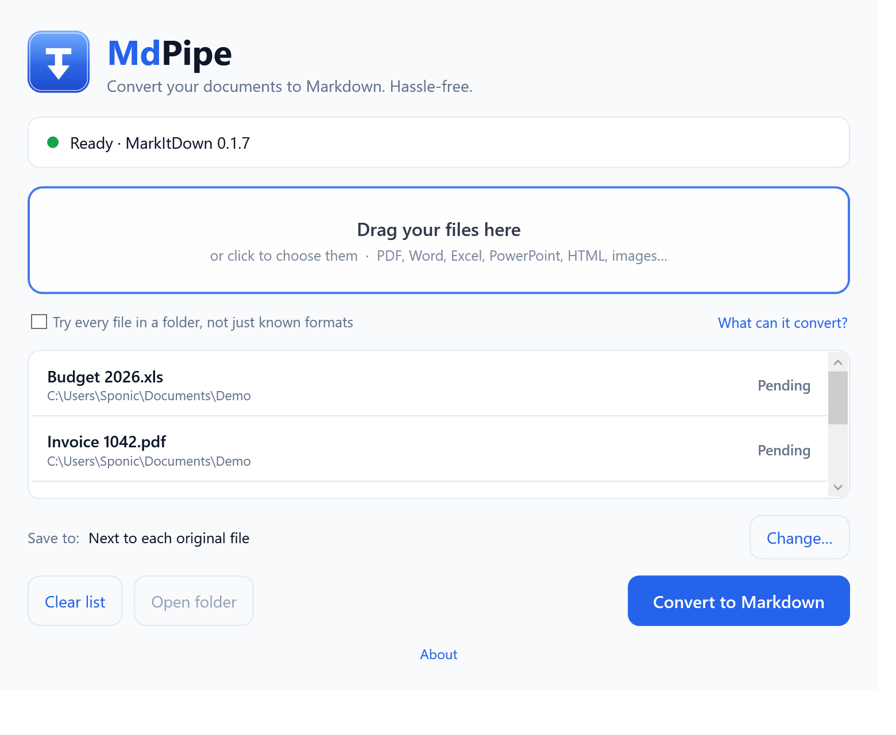
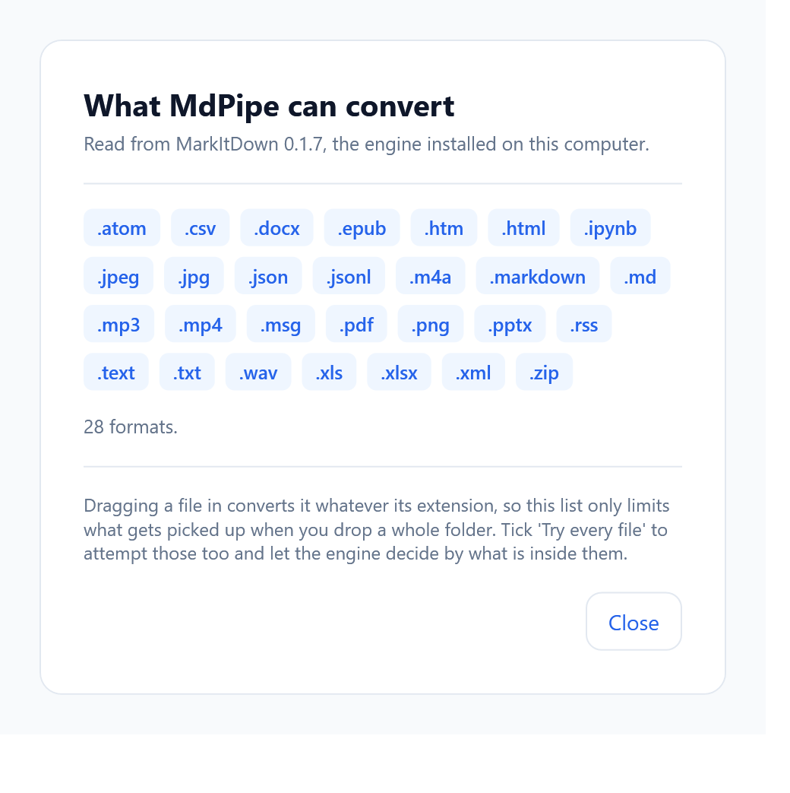
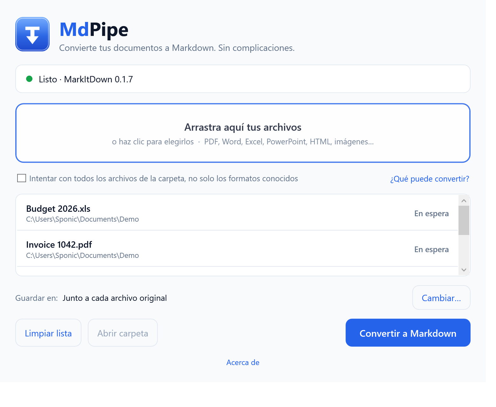

<p align="center">
  
</p>

# MdPipe

<p align="center">
  <a href="https://github.com/gdols/MdPipe/releases/latest"></a>
  <a href="https://github.com/gdols/MdPipe/releases"></a>
  <a href="LICENSE"></a>
  
</p>

MdPipe converts PDF, Word, Excel, PowerPoint, HTML and images to Markdown on
Windows. It is available as a portable desktop application and as a .NET CLI.
Conversion runs through Microsoft's
[MarkItDown](https://github.com/microsoft/markitdown).

## Download

<p align="center">
  <a href="https://github.com/gdols/MdPipe/releases/latest/download/MdPipe.exe">
    
  </a>
  <br>
  <sub><b>One file. No installer. No .NET or Python required.</b></sub>
</p>

It is a portable, self-contained Windows 10/11 x64 executable. The first launch
downloads a private Python environment and MarkItDown into `%APPDATA%\mdpipe`;
later conversions work offline. Because the executable is not code-signed yet,
Windows SmartScreen may ask you to confirm that you want to run it.

<p align="center">
  
</p>

I built MdPipe so I could give someone a document converter without first asking
them to install Python or work from a terminal.

## What it can convert

| | |
|---|---|
| **Documents** | `.pdf` `.docx` `.pptx` `.epub` |
| **Spreadsheets** | `.xlsx` `.xls` `.csv` |
| **Web and data** | `.html` `.htm` `.xml` `.rss` `.atom` `.json` `.jsonl` `.ipynb` |
| **Text** | `.txt` `.text` `.markdown` `.md` |
| **Images** | `.png` `.jpg` `.jpeg` |
| **Audio** | `.mp3` `.wav` `.m4a` `.mp4` |
| **Other** | `.msg` (Outlook mail) `.zip` (converts what is inside) |

That list is not written by hand. MdPipe asks the MarkItDown installed on your machine what
its converters accept, so the app always tells you the truth about your own computer rather
than repeating someone else's documentation. The same list is a click away in the app:

<p align="center">
  
</p>

Three details worth knowing:

- **Naming a file directly converts it whatever its extension.** The list above only decides
  what gets picked up when you drop a whole folder. If you have files with a wrong or missing
  extension, tick *Try every file* (or pass `--all-files`) and the engine will decide by what
  is inside them.
- **Markdown files are skipped when scanning a folder**, on purpose: the output would land on
  top of the input and rewrite your own notes.
- Word and PowerPoint files from the 1990s (`.doc`, `.ppt`) have no converter anywhere in this
  chain. MdPipe says so and tells you to save them as `.docx` or `.pptx` first.

## The app speaks your language

It follows whatever language Windows is set to: Spanish on a Spanish machine, English
everywhere else. Nothing to configure.

<p align="center">
  
</p>

## What it does

- Converts several files in one batch using drag and drop. Folders work too,
  subfolders included, and a whole batch shares one engine process instead of
  starting a new one per file.
- Opens files dropped straight onto the executable, or sent to it with
  "Open with".
- Saves the Markdown beside the original or in a chosen folder, and remembers
  your choice for next time.
- Shows real download progress during the first-run setup, and conversions can
  be cancelled midway.
- Runs locally without uploading documents or collecting telemetry.
- Includes a CLI for scripts and automation.
- Keeps MarkItDown on a version tested with MdPipe, and picks up newly
  validated versions on launch.

## CLI

The repository also includes a CLI for scripts and local use. Run it from source
with the .NET 10 SDK:

```bash
dotnet run --project src/MdPipe.Cli -- convert report.pdf
dotnet run --project src/MdPipe.Cli -- convert report.pdf -o report.md
dotnet run --project src/MdPipe.Cli -- status
```

It takes several inputs at once: files, folders or patterns. With one file and no
`--output` the Markdown goes to stdout; otherwise `--output` is the folder to fill,
and without it each file is saved next to its original.

```bash
mdpipe convert a.pdf b.docx                 # several files
mdpipe convert .\docs --recursive           # a folder, subfolders included
mdpipe convert *.pdf --output .\markdown    # a pattern, all into one folder
mdpipe convert .\docs --all-files           # try everything, not just known formats
mdpipe formats                              # what this machine's engine can read
```

A file that fails does not stop the rest; you get a summary at the end and a
non-zero exit code if anything failed, which is what a script wants.

## How it works

The WPF application and CLI share the same conversion and setup code. MdPipe
creates its environment under AppData and does not modify the system Python or
`PATH`.

A small [compatibility manifest](docs/version-control.md) records the MarkItDown
versions tested with MdPipe. Setup also passes the Windows proxy to pip and keeps
its output visible when a firewall, proxy or SSL inspection blocks the download.

There is a longer write-up with code samples on
[gdols.dev](https://gdols.dev/blog/como-hice-mdpipe/).

## Build from source

You need the [.NET 10 SDK](https://dotnet.microsoft.com/download):

```bash
git clone https://github.com/gdols/MdPipe.git
cd MdPipe

dotnet run --project src/MdPipe.Wpf
dotnet test
```

To build the portable executable:

```bash
dotnet publish src/MdPipe.Wpf -c Release -r win-x64 --self-contained -p:PublishSingleFile=true
```

## Limitations

- Official releases currently target Windows x64 only.
- The first launch needs internet access to download Python and MarkItDown.
- The executable is not code-signed, so new releases can trigger SmartScreen.
- Conversion quality depends on the source format and MarkItDown.

## License

MdPipe is available under the MIT license. It is an independent project and is
not affiliated with Microsoft. MarkItDown is fetched from PyPI at runtime and
is not redistributed; see [NOTICE.md](NOTICE.md).

Bug reports and small pull requests are welcome. See
[CONTRIBUTING.md](CONTRIBUTING.md) and [SECURITY.md](SECURITY.md).

